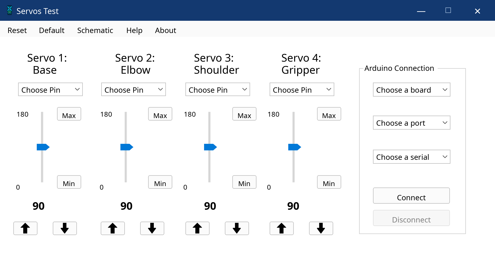
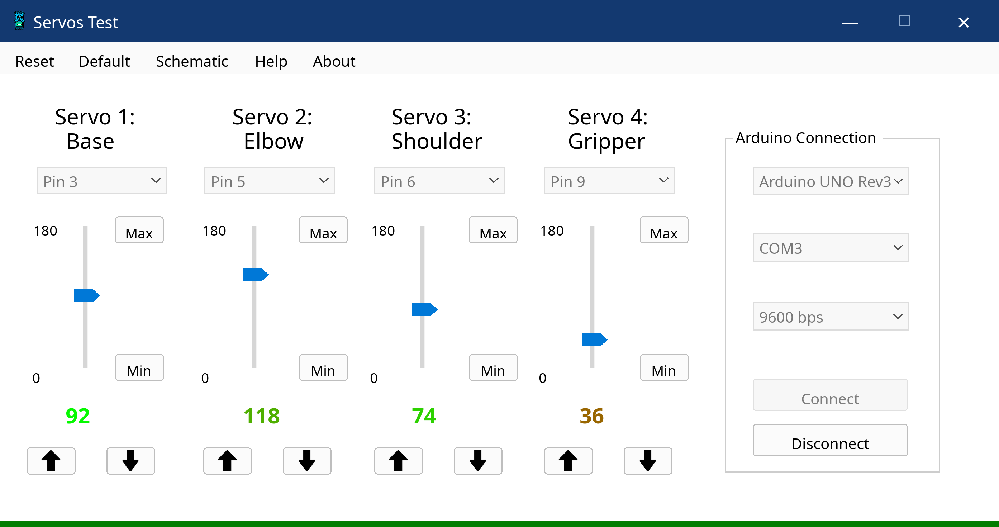
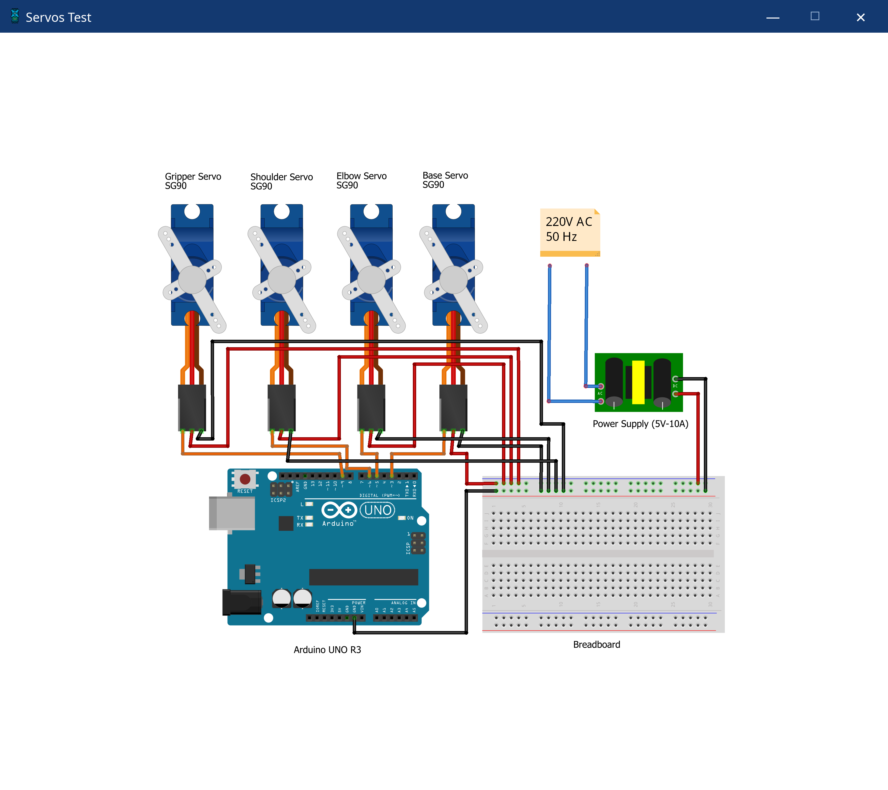
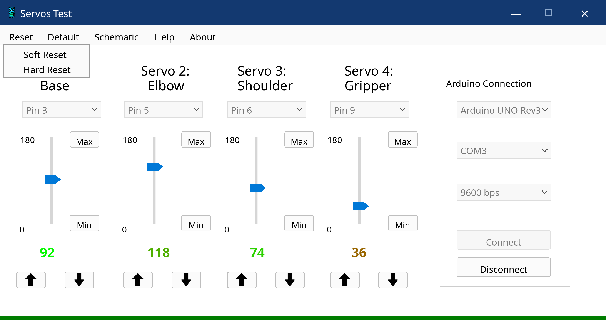
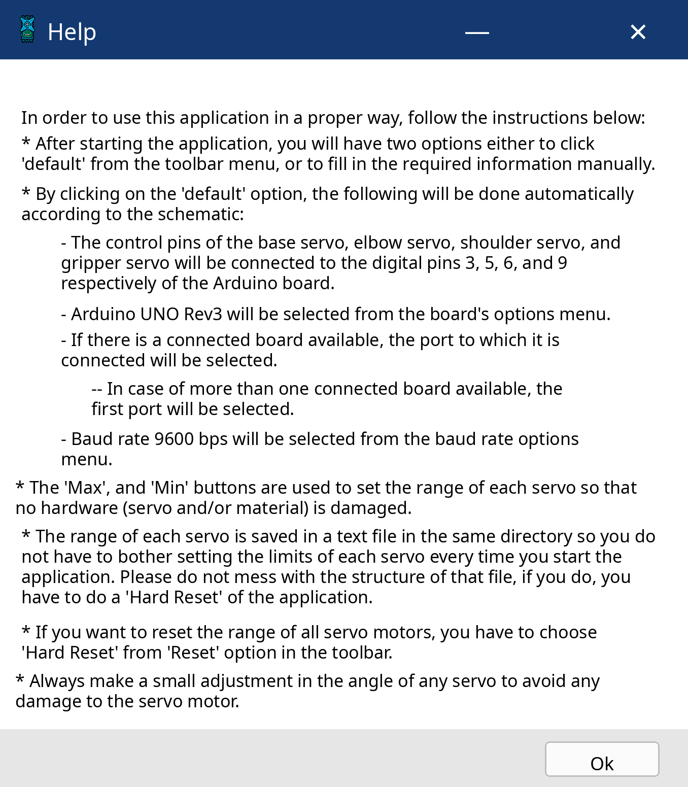
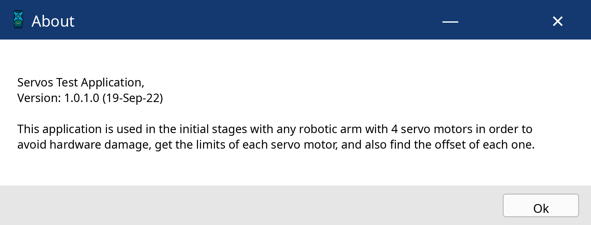

# Arduino Four-Servo Controller

Arduino Four-Servo Controller is a C# Windows Forms desktop application for configuring, calibrating, and controlling four servo motors through an Arduino-compatible board.

The application was developed to support the initial setup of a four-servo robotic arm. It provides separate controls for the base, elbow, shoulder, and gripper servos, while helping identify safe movement limits and servo offsets before further robotic-system integration.

## Preview



The main interface provides independent controls for the base, elbow, shoulder, and gripper servos, together with PWM-pin selection and Arduino connection settings.



After connecting, the application displays the current angle of each servo and enables direct adjustment through sliders and increment/decrement controls.



The included schematic documents the wiring between the Arduino board and the four servo motors.



The reset menu provides a soft reset for restoring the interface state and a hard reset for clearing stored calibration limits.



The built-in Help window explains the default configuration, servo calibration process, and hardware-safety considerations.



The About window describes the application as an initial setup and calibration tool for robotic arms using four servo motors.

## Main Features

* Independent control of four servos: base, elbow, shoulder, and gripper
* Vertical angle sliders with one-degree increment and decrement controls
* Individual minimum and maximum angle calibration
* Persistent calibration limits saved between sessions
* Selection of distinct PWM pins from pins 3, 5, 6, 9, 10, and 11
* Arduino board, serial port, and baud-rate selection
* Automatic upload of the matching embedded Arduino firmware
* Serial transmission of the four servo-angle values
* Default configuration for the documented wiring schematic
* Soft-reset and hard-reset operations
* Validation for missing selections and disconnected boards
* Built-in schematic, Help, and About windows
* Original portable Windows executable and complete source project

## Technical Overview

The desktop application is written in C# using Windows Forms and targets .NET 6 for Windows.

The interface manages four servo channels:

| Channel | Role     |
| ------- | -------- |
| Servo 1 | Base     |
| Servo 2 | Elbow    |
| Servo 3 | Shoulder |
| Servo 4 | Gripper  |

Each servo is assigned a distinct PWM pin. The application prevents the same selected pin from being assigned to more than one servo.

The supported board profiles are:

* Arduino Leonardo
* Arduino Mega 1284
* Arduino Mega 2560
* Arduino Micro
* Arduino Nano R2
* Arduino Nano R3
* Arduino Uno R3

Fifteen selectable serial baud rates are supported, ranging from 300 to 2,000,000 baud. A corresponding compiled Arduino firmware image is embedded for every supported baud rate.

When the user connects to a board, the application:

1. Validates the board, serial port, baud rate, and PWM-pin selections.
2. Extracts the matching embedded firmware image to a temporary location.
3. Uploads the firmware to the selected Arduino board.
4. Opens the serial connection using the selected baud rate.
5. Sends the current angles of all four servo motors whenever a control value changes.

The default configuration applies the following setup:

| Setting        | Default value        |
| -------------- | -------------------- |
| Base servo     | Pin 3                |
| Elbow servo    | Pin 5                |
| Shoulder servo | Pin 6                |
| Gripper servo  | Pin 9                |
| Board          | Arduino Uno R3       |
| Serial port    | First available port |
| Baud rate      | 9600                 |

Servo limits are stored in `Settings.txt` when the application closes. The application also creates `History Log.txt` to record application activity. Both files are generated at runtime beside the executable.

The source project uses:

* `ArduinoUploader`
* `IntelHexFormatReader`
* `System.IO.Ports`
* `System.Management`

## How to Run

### Portable executable

The repository root includes the original portable Windows executable:

```text
ServosTest.exe
```

To use it:

1. Place the executable in a writable folder.
2. Connect a supported Arduino board through USB.
3. Connect the four servos according to the included schematic.
4. Run `ServosTest.exe`.
5. Select **Default** to apply the documented configuration, or choose the settings manually.
6. Select **Connect** and allow the firmware-upload process to finish.
7. Adjust the servos gradually and define safe minimum and maximum limits.

The executable is a large single-file Windows build recovered from the original project archives. Its size and publication structure are consistent with a self-contained publication.

### Source project

Requirements:

* Windows
* Visual Studio with .NET desktop development support
* .NET 6 SDK
* A supported Arduino board and its required USB serial driver

Open:

```text
source/ServosTest.sln
```

Restore the NuGet packages, build the solution, and run the Windows Forms project.

The embedded firmware files under:

```text
source/ServosTest/Test/
```

are required for the automatic firmware-upload feature and should not be removed.

## Repository Contents

```text
README.md
ServosTest.exe
source/
  ServosTest.sln
  ServosTest/
    C# Windows Forms source
    form and application resources
    compiled Arduino firmware files
public/images/
  projects/
    arduino-four-servo-controller/
```

## Limitations

* The application is designed for Windows.
* The source includes compiled Arduino firmware images but not the original Arduino sketch source.
* Successful hardware operation depends on correct wiring, compatible board drivers, and an appropriate servo power setup.
* Servo limits should be calibrated gradually to avoid mechanical or electrical damage.
* The portable executable and hardware workflow were recovered from the original archives but were not retested with physical hardware during the Linux-based cleanup process.
* The application focuses on initial servo setup, limit identification, offset identification, and direct control; it is not a complete robotic-arm motion-planning system.